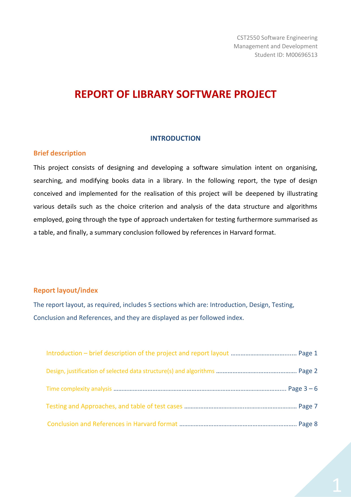
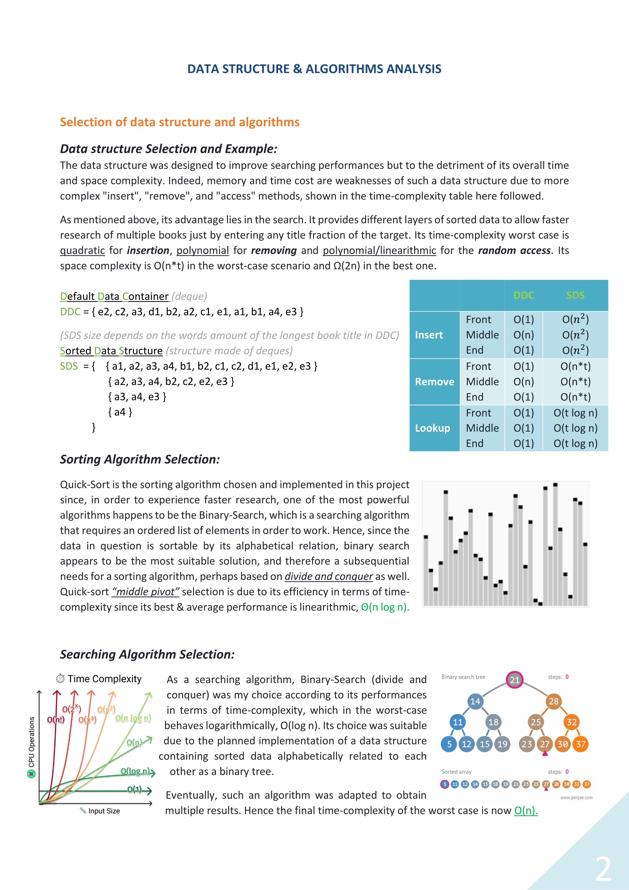
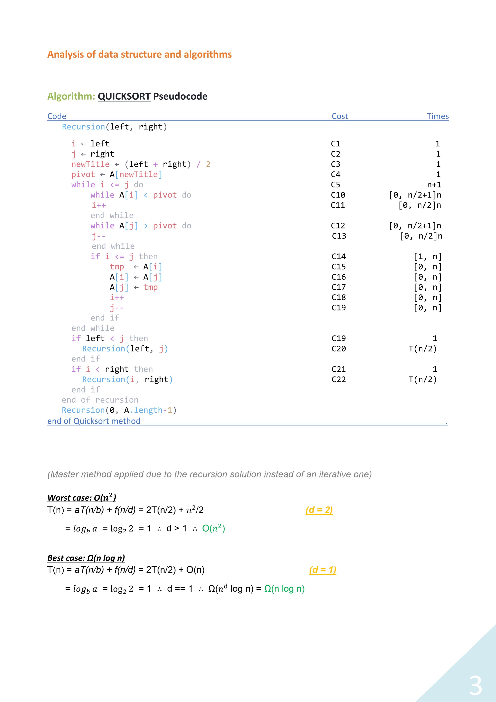
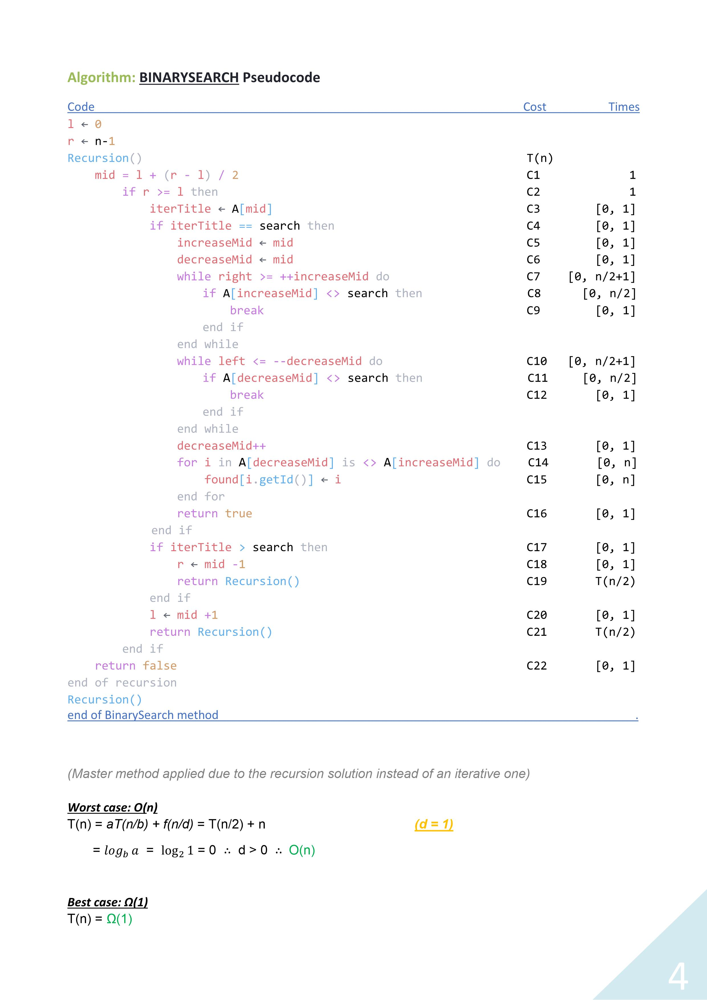
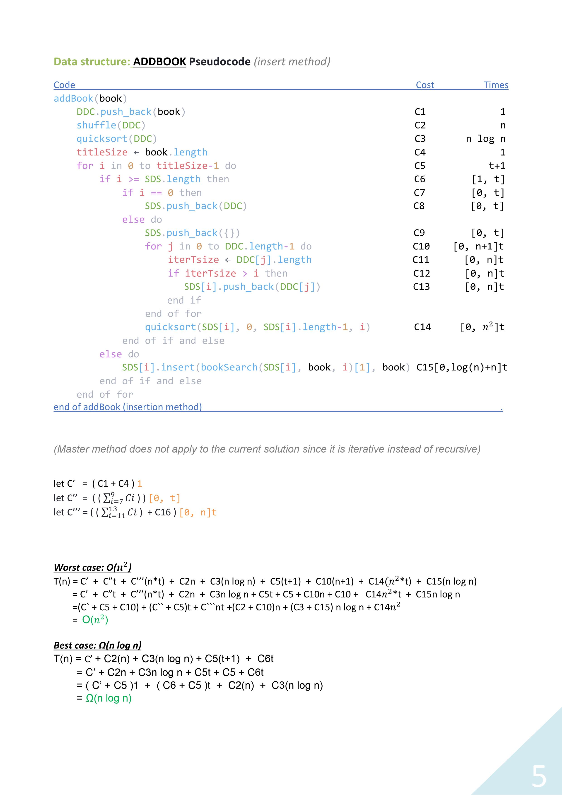
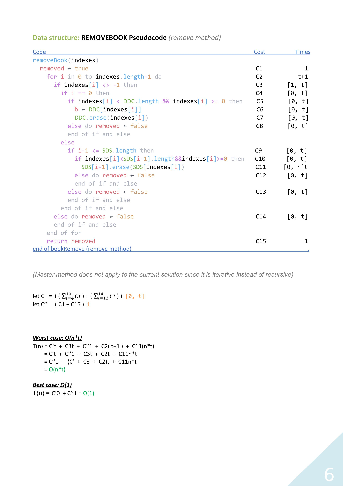
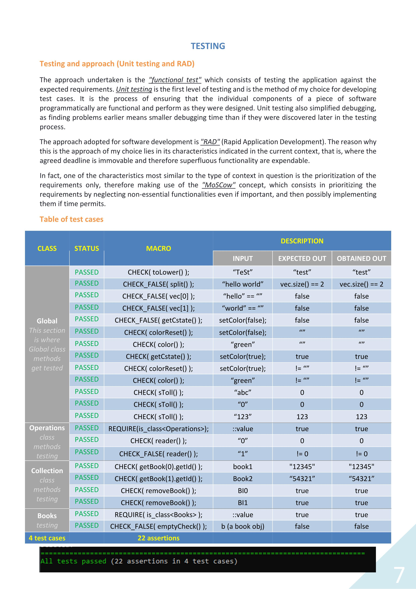
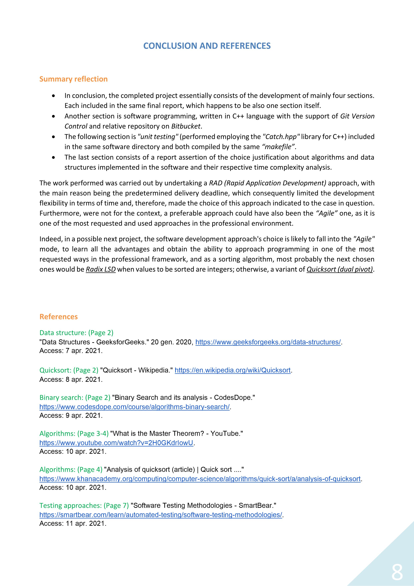

# Library-System

Welcome to the **Library-System** project! This is the second project developed during the Computer Science second-year course, focusing on Software Engineering and Management using C++. In this project, we aim to create management software for a library, optimizing book title searches with algorithms and data structures. Detailed reports present data structures and algorithms analysis.

## Overview

The Library-System management software enhances the efficiency of a library by providing quick and efficient book title searches. It utilizes C++ to implement advanced algorithms and data structures to speed up the search process.

## Getting Started

To run and test the Library-System project, follow these steps:

1. Clone this repository to your local machine.
2. Navigate to the `Library-System` directory.
3. Use the provided Makefile to compile and execute the project:
   - To compile and run the Library-System project, use `make run` command.
4. Explore the functionalities and features of the Library-System software as described in the README.md file within the `Library-System` directory.

Please ensure you have a C++ compiler and development environment set up on your system to use the provided Makefile.

## Prerequisites

Ensure you have a C++ compiler and development environment set up on your system.

## Technologies Used

- C++ - A powerful programming language for software development.

## Contributions

Contributions to this project are welcome. If you have any suggestions for improvements or want to optimize the Library-System software further, feel free to submit a pull request.

## License

This project is under the [MIT License](https://en.wikipedia.org/wiki/MIT_License), allowing you to use, modify, and distribute the code freely.

Let's build an efficient library management software using C++ and advanced algorithms! 📚📖💻

