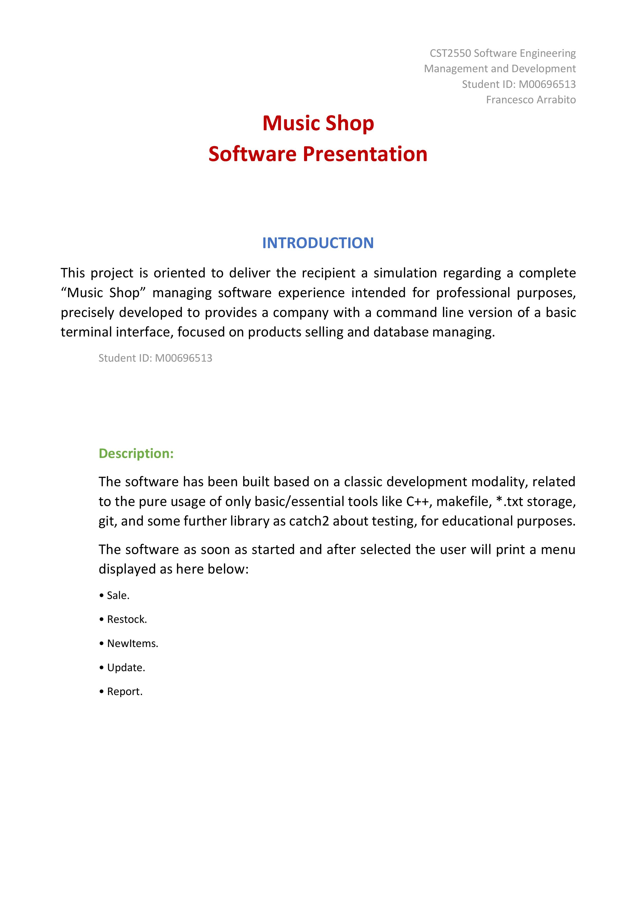
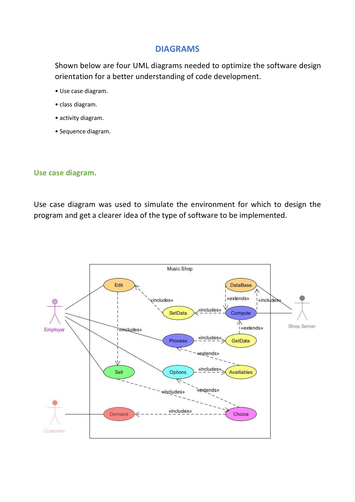
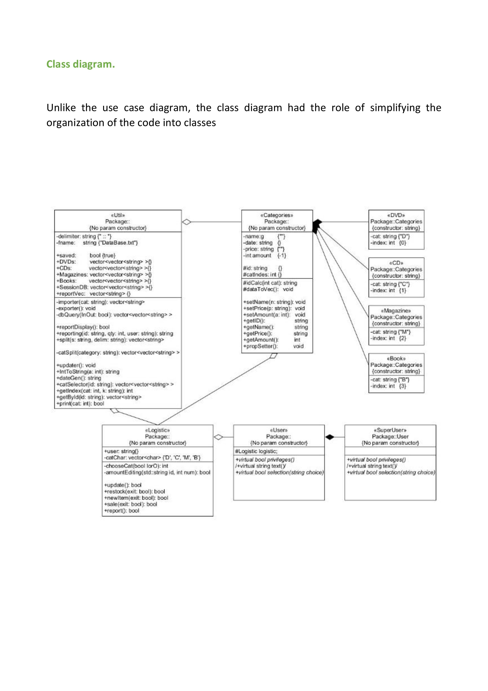
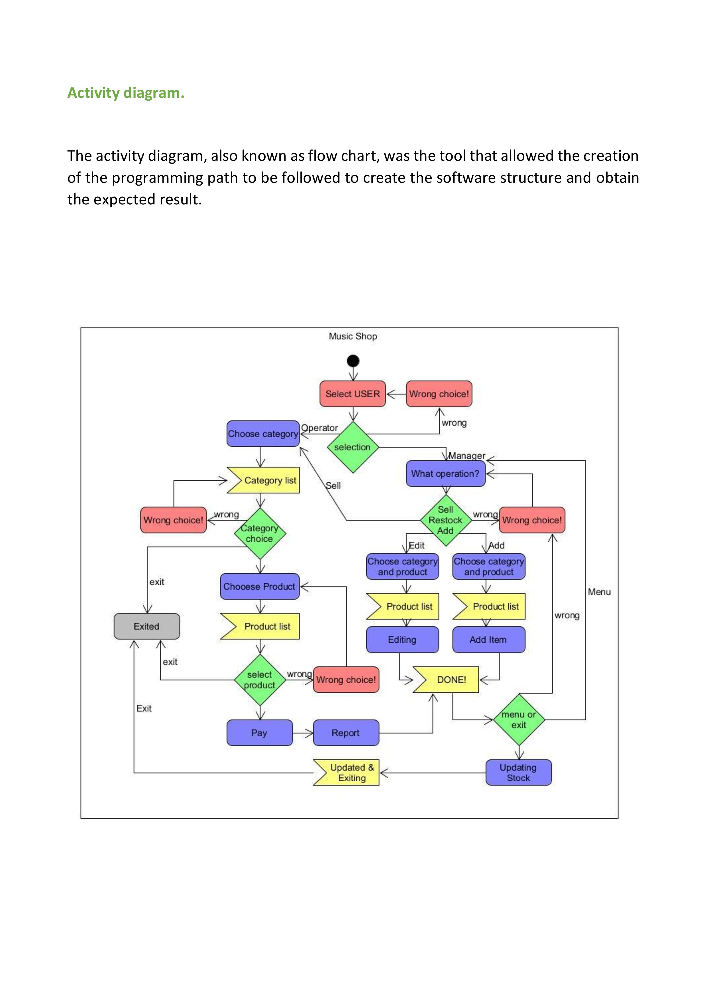
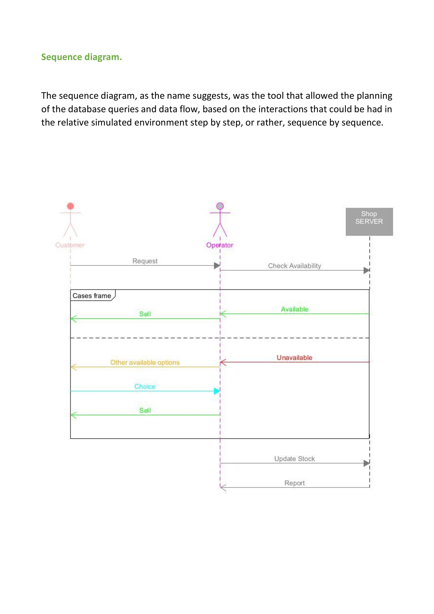
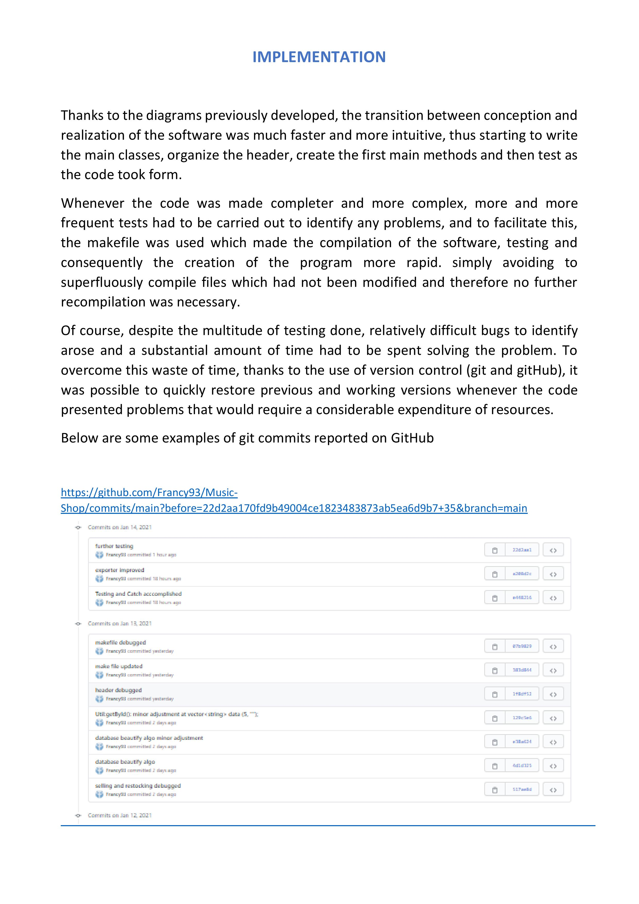
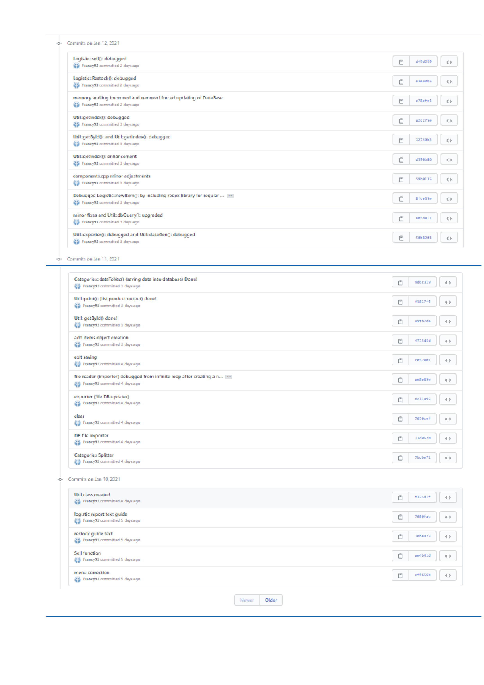
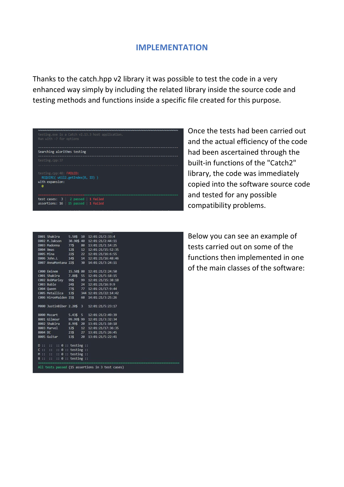
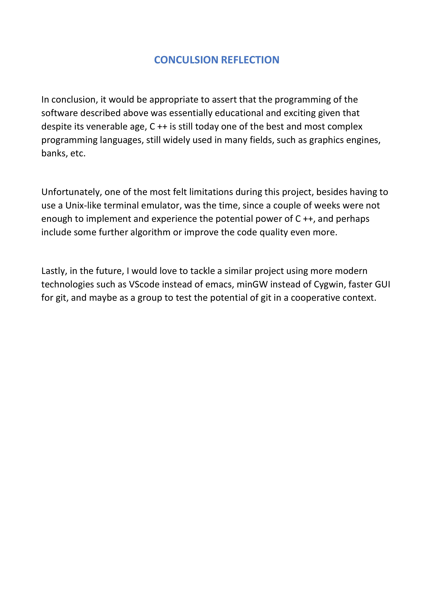

# Music-Shop

Welcome to the **Music-Shop** project! This is the first project developed during the Computer Science second-year course, focusing on Software Engineering and Management using C++. In this project, we aim to create management software for a music shop, including algorithms for logistic management and unit tests using catch.hpp.

## Overview

The Music-Shop management software streamlines the operations of a music shop, providing efficient inventory management and logistics. It leverages C++ to handle various functionalities, ensuring smooth day-to-day operations.

## Getting Started

To run and test the Music-Shop project, follow these steps:

1. Clone this repository to your local machine.
2. Navigate to the `Music-Shop` directory.
3. Use the provided Makefile to compile and execute the project:
   - To compile and run the Music-Shop project, use `make run` command.
4. Explore the functionalities and features of the Music-Shop software as described in the README.md file within the `Music-Shop` directory.

Please ensure you have a C++ compiler and development environment set up on your system to use the provided Makefile.

## Prerequisites

Ensure you have a C++ compiler and development environment set up on your system.

## Technologies Used

- C++ - A powerful programming language for software development.
- catch.hpp - A C++ library used for unit testing.

## Contributions

Contributions to this project are welcome. If you have any suggestions for improvements or want to add more features to the Music-Shop management software, feel free to submit a pull request.

## License

This project is under the [MIT License](https://en.wikipedia.org/wiki/MIT_License), allowing you to use, modify, and distribute the code freely.

Let's build efficient management software for a music shop using C++! 🎶🎵🎸

